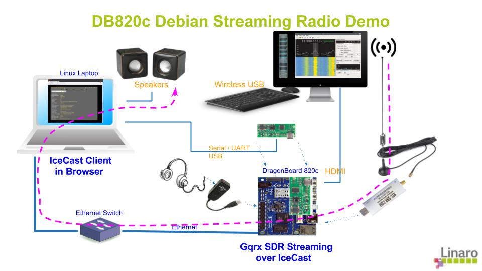

# streaming-radio
This is primarily an instructional repo that outlines the steps to use IceCast and Gqrx on DragonBoards 820c in creating a streaming SDR.

# Initial Setup
This demo uses an RTL-SDR USB audio dongle based on the RTL2832U chipset. The good news is these are only $20! The Gqrx open source application connects to the dongle and decodes full-spectrum radio including FSRS, Amature Radio bands, FM Radio, National Weather frequencies, Air Traffic control, and more.   It then leverages the streaming UDP output of Gqrx, uses VLC to convert this to Ogg and sends it to the open source streaming audio server application IceCast, creating a streaming radio that streams the radio frequencies being played to client computers.   The high level demo setup is shown in the picture below.

The remainder of this section goes through the steps to configure the DragonBoard 820c for the demo.

# References
* [The Gqrx SDR home page](http://gqrx.dk/)

# Extra Credit 
If you got this far, congratulations!  You are streaming radio over your home network, and with minor modifications, even over the internet!  This section lists some possible follow-on extensions to the project that could be fun.
* Build and use a gstreamer pipeline instead of VLC to convert the output of Gqrx into an IceCast source stream. I've given it a try, but unsuccessful to date.  Ping me if you want my gstreamer pipelines I have attempted to no avail.
* Use other SDR's insteam of Gqrx.
* Use more elaborate and advances antennas to improve reception.
* Create a scanner.  Some starting code can be found for this in the community.
* Punch through your firewall and stream to the internet.
* others?
