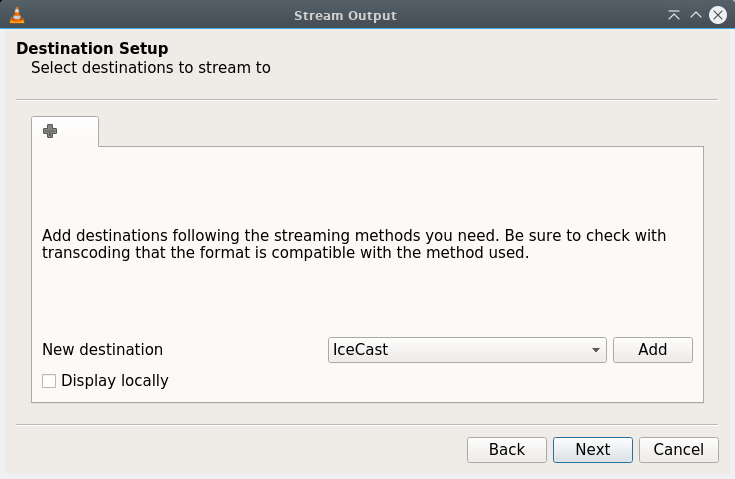

# streaming-radio
This is primarily an instructional repo that outlines the steps to integrate IceCast and Gqrx on DragonBoards 820c (herein referred to interchangably with "the target") along with a RTL-SDR USB dongle in creating a streaming SDR.  Note that it is configured to run only on the local network.  It does not go through local firewall and expose itself on the web, but this would be something that could be done with minor enhancements.

# Initial Setup
This demo uses an RTL-SDR USB audio dongle based on the RTL2832U chipset. The good news is these are only $20! The Gqrx open source application connects to the dongle and decodes a large range of the radio spectrum (from 500 KHz to 1.7 GHz) including FSRS, Amature Radio bands, FM Radio, National Weather frequencies, Air Traffic Control, and more.   It then leverages a raw audio streaming output feature of Gqrx,  transcodes this to Ogg using VLC, and sends it to IceCast, an open source streaming media server application (also running on the Target), creating a streaming radio server that can stream the radio frequencies being played to multiple client computers over the network. A high level view of the demo setup is shown in the picture below.


* Information on the UART Serial Mezzanine can be found [here](https://www.96boards.org/product/uartserial/)
* Information on the DragonBoard 820c can be found **tbd**
* I used [this](https://www.amazon.com/gp/product/B01N905VOY/ref=oh_aui_detailpage_o05_s00?ie=UTF8&psc=1) USB Audio Adaptor
* And I used [this](https://www.amazon.com/RTL-SDR-Blog-RTL2832U-Software-Telescopic/dp/B011HVUEME/ref=sr_1_34?ie=UTF8&qid=1502428142&sr=8-34-spons&keywords=rtl-sdr+usb&psc=1) SDR Dongle

See an actual photo of my demo setup below:


It's highly recommended to have a fan blowing over the Target. I even added some small heat sinks onto the EMI shield just to keep the Target running nice and cool.

Software versions:

* **Build 68** of the DragonBoard 820c was used and can be found on the 96boards web site.  A later build could be used and new features are being added regularly, so a later build may be a good choice. The builds can be found [here](http://builds.96boards.org/snapshots/dragonboard820c/linaro/debian/).
* IceCast Version 2.4.3
* VLC Version 2.2.6
* Gqrx 2.6

The remainder of this section goes through the steps to configure the DragonBoard 820c for the demo. Note that these sections are intended to be execute sequentially.  It also assumes you are logged in as `linaro`

## Install Debian image on the Dragonboard 820c 
To install the Debian image, follow the instructions for **Installing Debian - Console image** found [here](https://github.com/96boards/documentation/wiki/Dragonboard-820c-Getting-Started-With-Linux).  

If you have access to internal linaro wiki an additional page for initializing UFS can be found [here](https://wiki.linaro.org/Internal/QCOM/DragonBoard-820c). 

## Install LXQt desktop
Installing the LXQt Desktop is done by following the **Graphical image (with GPU)** section in the same document [here](https://github.com/96boards/documentation/wiki/Dragonboard-820c-Getting-Started-With-Linux).

## Install and configure demo applications

This section shows how to install, configure and validate VLC, GKRellm, Gqrx, and IceCast.  Execute the following commands in a terminal on the DragonBoard 820c:

### Install the new packages required:
```
sudo apt-get update
sudo apt-get -y install vlc
sudo apt-get -y install gkrellm
sudo apt-get -y install git
sudo apt-get -y install cmake
sudo apt-get -y install libusb-1.0-0.dev
sudo apt-get -y install build-essential
```
OR install all at once:
```
sudo apt-get update
sudo apt-get -y install vlc gkrellm git cmake libusb-1.0-0.dev build-essential
```
### Configure the system for the RTL-2832U USB dongle

From a terminal on the DragonBoard 820c, first build and install the RTL-2832U USB dongle driver,

```
git clone git://git.osmocom.org/rtl-sdr.git
cd rtl-sdr/
mkdir build
cd build
cmake ../
make
sudo make install
sudo ldconfig
```
Next reate the rtl-sdr rules. Plug the RTL-SDR dongle into the USB Port on the DragonBoard 820c and execute the following command to determine the VenderID and ProductID of the dongle:

`lsusb|grep Real`

You should get an output similar to the following:

`Bus 001 Device 003: ID 0bda:2838 Realtek Semiconductor Corp. RTL2838 DVB-T`

From the above, determine the VenderID and Product ID.  In the example above, the VenderID is `0bda` and the ProductID is `2838`. 

Create the rtl-sdr.rules file:

`sudo vi /etc/udev/rules.d/rtl-sdr.rules`

And insert the following line:
`SUBSYSTEMS=="usb", ATTRS{idVendor}=="**0bda**", ATTRS{idProduct}=="**2838**", MODE:="0666"`

Save the file and exit.

Power cycle with the SDR USB Dongle disconnect and **after** the system has booted, install the dongle.

To test the driver build above and assure it's working correctly, run the following command:

`sudo rtl_test -t`

Successful results should look similar to the following:

```
sudo rtl_test -t
Found 1 device(s):
  0:  Realtek, RTL2838UHIDIR, SN: 00000001

Using device 0: Generic RTL2832U OEM
Found Rafael Micro R820T tuner
Supported gain values (29): 0.0 0.9 1.4 2.7 3.7 7.7 8.7 12.5 14.4 15.7 16.6 19.7 20.7 22.9 25.4 28.0 29.7 32.8 33.8 36.4 37.2 38.6 40.2 42.1 43.4 43.9 44.5 48.0 49.6 
[R82XX] PLL not locked!
Sampling at 2048000 S/s.
No E4000 tuner found, aborting.
```
Don't worry about the ominous last three lines above. Things work fine with those.  If you happen to run the rtl_test command while Gqrx is running the output is a little different as follows:

```
Found 1 device(s):
  0:  Realtek, RTL2838UHIDIR, SN: 00000001

Using device 0: Generic RTL2832U OEM
usb_claim_interface error -6
Failed to open rtlsdr device #0.
```

Again, don't worry about the last two lines above.

### Verify sound
Before installing Gqrx, let's go ahead and verify that audio is working.  

* Copy any .mp3 or .ogg audio file (a song) to the target. 
* Plug in a USB Audio Adaptor into the target and plug a set of headphones (or 3.5mm jack speaker) into the USB Audio Adaptor. (Note: Modify this step to use onboard 3.5 mm jack once audio has been integrated into the s/w builds)
* Bring up VLC found in the `Sound & Video` sub menu on the desktop.
* Play the song that was downloaded and verify that you can hear it.

If you cannot hear the song playing on the headphones, then open the `PulseAudio Volume Control` sub menu to bring up the audio configuration application as shown below:


Between VLC Preferences and Pulse Audio config, debug the configuration to make sure the USB Audio Adaptor is the default sound device and you can hear the song you are playing in VLC can be heard. Don't continue until sound is working on the target.

### Install Gqrx
As a reminder, these instructions are sequential and assume you have performed all steps successfully up to this point.

Install Gqrx:

```
sudo apt-get update
sudo apt-get -y install gqrx-sdr
```
Optimize the performance by running the following:

```
sudo apt-get install libvolk1-bin 
volk_profile
```
The above takes a while. 

### Set up GKRellM

From the LXQt desktop, select the `Systems Tools` submenu and bring up GKrellM.  Configure it so that you can keep an eye on the important system activities moving forward.  That includes Processor utilization, Network utilization, and Tempurature.


### Verify Gqrx is operational

Now from the LXQt desktop select the `Internet` submenu and bring up `Gqrx`.  A screen similar to below should appear:


Under `File-I/O Devices` select Realtek RTL2838UHIDIR for the `I/Q Input` and under the `Audio output` select the USB Audio device you have plugged in, and then click `OK`

Click on `Mode` under the `receiver Options` tab in the app and select a valid mode (`WFM Stereo` for example).  Just make sure it's not in `Demod Off`!

You are now ready to select `Start DSP`.  You must now select a valid frequency (such as an FM channel) for your region. Type this into the frequency select box. You should now be hearing FM radio.  

Do not continue until you are able to hear the radio.  

Play with the tool a little bit at this point. You should be able to listen to local airports, weather channels, CB, Amateur radio, and the list goes on.  Get familiar with the UI and learn to switch between the different modes (FM, AM, Narrow FM, etc) to dial in on all the airwaves.

### Install and Configure IceCast

```
sudo apt-get update
sudo apt-get -y install icecast2
```

Answer "no" to the question about whether you want to configure IceCast.

Now configure the IceCast Configuration file. 

`sudo vi /etc/icecast2/icecast.xml`

Below is the diff between mine and the default. I have also included mine in this repo.  Between referring to my example and reading [this,](http://icecast.org/docs/icecast-2.4.1/config-file.html) configure the file with the passwords and config options for your network setup.

```
diff icecast.xml original_icecast.xml 
5,6c5,6
<     <location>Scottsdale</location>
<     <admin>xyz.abc@mymail.com</admin>
---
>     <location>Earth</location>
>     <admin>icemaster@localhost</admin>
37c37
<         <source-password>linaro</source-password>
---
>         <source-password>hackme</source-password>
39c39
<         <relay-password>linaro</relay-password>
---
>         <relay-password>hackme</relay-password>
43c43
<         <admin-password>linaro</admin-password>
---
>         <admin-password>hackme</admin-password>
64c64
<     <hostname>192.168.1.115</hostname>
---
>     <hostname>localhost</hostname>
70c70
<         <shoutcast-mount>/stream</shoutcast-mount>
---
>         <!-- <shoutcast-mount>/stream</shoutcast-mount> -->
117c117
<         <local-mount>/donstream.ogg</local-mount>
---
>         <local-mount>/different.ogg</local-mount>
236a237
>         <!--
238,239c239,240
<             <user>icecast2</user>
<             <group>icecast</group>
---
>             <user>nobody</user>
>             <group>nogroup</group>
240a242
>         -->
```

Modify the following to enable init.d script

`sudo vi /etc/default/icecast2`

Change "ENABLE=false" to ENABLE=true"  and save.  Then restart IceCast

`/etc/init.d/icecast2 restart`

Yuo can now verify it's running.  Enter the following to see if the IceCast server is up and running

```
$ps -aux|grep icecast

linaro     460  0.0  0.0   4392   592 pts/1    S+   23:48   0:00 grep icecast
icecast2  2092  0.0  0.3 383604  9876 ?        Sl   Aug08   2:06 /usr/bin/icecast2 -b -c /etc/icecast2/icecast.xml
$
```
That's it.  Now through a browser from another computer on the local network, bring up the IceCast server running on the target.

`http://<Target_IP_Address>:8000`

Where **Target_IP_Adress** is the IP address of the DragonBoard 820c under test.  In my examples herein, that IP address is 192.168.1.115.  If everything is up and configured correctly, login is as `admin:password` and you will see a screen similar to the one below.


Do not continue until yo have gotten IceCast to render on another local computer on your network as shown above.

# Set up the demo
Now that everything is installed we can set up and run the demo.  
**NOTE:** This section is done each time you turn on power to the DragonBoard 820c and start up the demo.

* After applying power to the DragonBoard 820c, check to assure IceCast is running
```
$ps -aux|grep icecast

linaro     460  0.0  0.0   4392   592 pts/1    S+   23:48   0:00 grep icecast
icecast2  2092  0.0  0.3 383604  9876 ?        Sl   Aug08   2:06 /usr/bin/icecast2 -b -c /etc/icecast2/icecast.xml
$
```
* Start Gqrx on the DragonBoard 820c
    * Make sure playing audio
        * Put in headset into USB to Audio adapter, tune in a transmitting frequency and verify Audio can be heard locally.  Don't continue until this is working
* Set up Gqrx for USP Streaming under the Audio Options tab `...` - `Network` sub menu. Enter the IP address of the DragonBoard 820c (localhost may work as well). UDP Port can remain as 7355 default.
    
    
    
* Assure the `UDP` button on the main page is depressed, indicating that streaming is enabled.
* Use netcast to verify that UDP Streaming is happening by entering the following in a terminal window on the target:

  `nc -l -u 7355`

  If a stream of random characters are not scrolling in the terminal, debug.  Don't continue until verified.

* Optional:  If you wish you can enter the IP address of another Linux computer on your network and run VLC on it as follows to hear the radio audio from the Target:

  `cvlc --demux=rawaud --rawaud-channels=1 --rawaud-samplerate=48000 udp://@:7355`

* Open a terminal on the Target and start up VLC that will be used to transcode from Gqrx to IceCast

`vlc --demux=rawaud --rawaud-channels=1 --rawaud-samplerate=48000 udp://@:7355`

* VLC will come up. It should be playing Gqrx Audio locally. So you will have two audio sources playing at the same time. (Gqrx and VLC).  Can see that in Pulse Audio Volume control.

    

* Now that the front end raw audio is streaming into VLC, transcode and stream that to IceCast in by following the next several steps in the VLC app:

   * Select `Media` - `Open Network Stream`  on the bottom right dropdown
        * make sure the network URL field contains`udp://@:7355 :demux=rawaud:rawaud-channels=1:rawaud-samplerate=48000` and change `Play` to `Stream`
     
       
    
   * Leave `Source` field blank and just clicke `Next`
   * Now on `Destination Setup` screen change dropdown to `IceCast` and click `Add`
   
       
       
   * On `IceCast` congifuration screen, fill in the IceCast fields to align with the values customized in the /etc/icecast2/icecast.xml file that was customized during configuation.  In particular, `<source-password>`, `<hostname>`, and `<local-mount>`.  Note under `Login:pass`, Login is always `source`.   Then click `Next`
   
       

   * On the `Transcoding Options` screen, select `Audio-Vorbis (OGG)` option and select `Next`
   * Should now be on the final `Option Setup` summary screen, review settings and click `Next`.  Transcoding Raw audio from Gqrx to ogg and streaming this to IceCast will now begin.
   * In Gqrx, if you are tuned into a frequency that has an active transmitter (such as an FM radio channel) and the `Steam Raw audio over UDP` button is depressed, then you will be able to hear the stream over the network by selecting the IP address and port of the Target.  
   
       


 That's it! You are now setup with your own SDR streaming over IceCast!
   

# Debug hints
Helpful debug hints when setting up and verifying this demo:

### Check status of icecast

`ps -aux|grep icecast`

### IceCast commands from DragonBoard 820c terminal:

```
/etc/init.d/icecast2 start
/etc/init.d/icecast2 stop
/etc/init.d/icecast2 restart
```

### Checking to see if Gqrx UDP is streaming:

`nc -l -u localhost 7355`  or `nc -l -u 7355` or `nc -l -u <IP Address of 820c> 7355` 

Can be entered from the terminal to see the UDP streaming from Gqrx.When executed from a terminal on the target, the above will create a random character stream in the terminal window on the target. Note there may be cases where one of these will work and another will not. 

### Monitoring board temperature

Note that since the kernel is not entirely integrated at the time of this writing, it's a very good idea to monitor and control the temperature on the board.

Two options were used to monitor temperature

1) From Command Line enter:

   `cat /sys/class/thermal/thermal_zone*/temp`

   There are four zones that will come up similar to the following:
   ```
   cat /sys/class/thermal/thermal_zone*/temp
   41600
   41900
   42900
   42900
   ```
   At the time of this writing, I don't know where these 4 zones are on the board.
   Divide each of the above by 1000 to come up with degrees celsius.

2) GKrellm (Preferred)
   We already installed GKrellm, so just start it up and configure it to show thermals.  It will list all 4 zones in Celsius

   To control and minimize the risk of overheating, expecially with an application like Gqrx that requires a lot of processor power to perform the frequency transforms in software, it is recommended at this time to add small heat sinks and have a small fan cooling over the board.
    
       


# References
* [The Gqrx SDR home page](http://gqrx.dk/)
* [Setting up RTL-2832U USB Dongle for Raspberry Pi](http://zr6aic.blogspot.ca/2013/02/setting-up-my-raspberry-pi-as-sdr-server.html) was very helpful.
* How the UDP Streaming works on Gqrx; a nice writeup [here](http://gqrx.dk/doc/streaming-audio-over-udp#more-157)
* [Youtube video]()https://www.youtube.com/watch?v=4kJc1aKg17c&t=8s that was helpful in connecting Gqrx to IceCast using VLC
* [Installing IceCast on Debian](https://tech.tiq.cc/2014/03/how-to-set-up-icecast2-on-debian/)
* Details about the IceCast config file icecast.xml can be found [here](http://icecast.org/docs/icecast-2.4.1/config-file.html)


# Next Steps 
If you got this far, congratulations!  You're streaming radio over your home network, and with minor modifications, even over the internet!  This section lists some possible follow-on extensions to the project that could be fun.  If you beat me to it, great! 

* Build other transcoder pipeines like gstreamer instead of VLC to convert the output of Gqrx into an IceCast source stream.  Automate the VLC transcoder pipeline so that totally turned on from command line.
* Use other SDR's instead of Gqrx.
* Test with some different SDR Dongles other than the one used here.
* Build Gqrx from source and redo the demo.  This would be the first step in investigating ways to do some performance improvements.
* Experiment with Antennas antennas to improve reception.
* Create a scanner. Some starting code can be found for this in the community.
* Punch through your firewall and stream to the internet.
* Build your DragonBoard 820c from source.  
* others?
